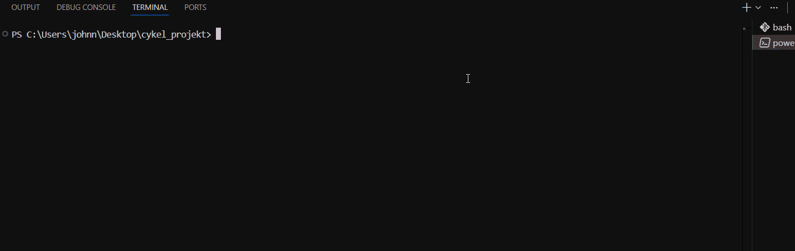

# Space Bridge — mikro-ETL (JSONL -> CSV/SQLite) med QA och rapport

## Demo on how to run.


**Syfte**  
Träna och demonstrera Data Engineering vanor: idempotent ETL, tydliga kvalitetsgrindar (QA), mätbarhet och config-styrning. Projektet är byggt i cykler (C1–C8) och designat för att vara lätt att granska, köra om och visa upp (demo).

---

## Tech stack

- Python 3.13 (standardbibliotek; valfritt venv)
- SQLite (WAL-läge per connection)
- PowerShell/CLI (Windows)

Inga tredjeparts-paket krävs för kärnflödet.

---

## Repository structure

```text
.
├─ data/
│  ├─ space_logs.jsonl        # (C3) syntetisk rådata (valfritt för demo)
│  ├─ planet_counts.json      # (C1) aggregeringar per planet
│  ├─ counts_enriched.csv     # (C2) planet,count,share (6 d.p.)
│  ├─ report_top.csv          # (C8) export (Top-N)
│  └─ space_bridge.db         # SQLite (git-ignored)
│
│
├─ cli.py                     # C4/C8: kommandogränssnitt
├─ count_planets.py           # C1: JSONL -> counts.json(+csv)
├─ counts_enrich.py           # C2: counts.json -> enriched.csv
├─ gen_space_logs.py          # C3: generator för syntetisk data
├─ bench_100k.py              # C3: enkel benchmark
├─ sql_sink.py                # C5–C8: SQLite-sink, QA, export
├─ tests_smoke.py             # C4: röktest
├─ test_enrich_counts.py      # C2: enhetstest för enrich
├─ results.csv                # manuell körlogg (cykler/notes)
├─ runs.csv                   # automatiska mätningar (C1/C3)
├─ config.example.json        # exempel på konfig (kopiera -> config.json)
├─ .gitignore
└─ README.md
````

---

## Environment & setup

**Valfritt (rekommenderat)** – skapa venv:

```powershell
python -m venv .venv
.\.venv\Scripts\Activate.ps1
```

**Konfig**

**OBS:** Kopiera `config.example.json` -> `config.json` och justera paths vid behov:

```json
{
  "db": "data/space_bridge.db",
  "counts_json": "data/planet_counts.json",
  "enriched_csv": "data/counts_enriched.csv",
  "top": 3,
  "max_share_sum": 1.000001
}
```

---

## How to run

### Quickstart (C5–C8)

```powershell
# Ladda artefakter -> SQLite (UPSERT + QA)
python cli.py sql-load --config config.json

# Exportera Top-N-rapport (planet,count,share)
python cli.py sql-report --config config.json --out data\report_top.csv
```

Förväntat i nuläget: 8/8 rader, `SUM(share)=1.0`, samt `data/report_top.csv` med 3 rader + header.

### Fullt flöde (om du vill återskapa artefakter)

```powershell
# C1: Räkna planeter (från JSONL)
python cli.py count  --in data\space_logs.jsonl --out data\planet_counts.csv

# C2: Beräkna andelar (från counts.json)
python cli.py enrich --in data\planet_counts.json --out data\counts_enriched.csv --top 3

# C5–C7: Ladda till SQLite (QA körs automatiskt)
python cli.py sql-load --config config.json

# C8: Exportera topp-N
python cli.py sql-report --config config.json --out data\report_top.csv
```

`Exit codes: 0=OK, 2=input saknas, 3=QA/asserter, 4=oväntat fel`  
**För att kolla exit code i PowersShell**  
`; echo $LASTEXITCODE`

---

## Arkitektur (C1–C8)

* **C1**: `count_planets.py` -> `planet_counts.json` (+ tidslogg i `runs.csv`)
* **C2**: `counts_enrich.py` -> `counts_enriched.csv` (andelar, 6 d.p.)
* **C3**: `gen_space_logs.py` (syntetisk data) + `bench_100k.py`
* **C4**: `cli.py` för `count`/`enrich`, central input-guard, versionflagga
* **C5**: `sql_sink.py` (SQLite sink) – UPSERT per `planet`, WAL, UTC-stämplar
* **C6**: `config.json` + `run_from_config()` + `quick_checks(top)`
* **C7**: `CHECK`-constraints i DB + `validate()` (negative/share_oob/mismatch/empty_names) + `preflight_inputs()` före DB-skrivning
* **C8**: `export_top_csv()`/`export_from_config()` -> `data/report_top.csv` + CLI `sql-report`

---

## Datakvalitet (QA)

**DB-nivå (SQLite SCHEMA)**

* `planet` icke-tom: `CHECK(length(trim(planet)) > 0)`
* `count >= 0`
* `0.0 <= share <= 1.0`
* `updated_at` enkel ISO-längdcheck

**Kod-nivå**

* `validate()` samlar fel i: `negative_counts`, `share_out_of_range`, `mismatch`, `empty_names` och kastar tydlig `ValueError` (med summering + exempel).
* **Massbalans**: `assert SUM(share) ≤ 1.000001`.
* **Preflight**: jämför `planet_counts.json` <--> `counts_enriched.csv` **innan** DB-skrivning.

**Idempotens**
UPSERT per `planet` (PRIMARY KEY) gör körningar repeterbara utan dubbletter.

---

## Kommandon (CLI)

```powershell
# C1
python cli.py count  --in data\space_logs.jsonl   --out data\planet_counts.csv
# C2
python cli.py enrich --in data\planet_counts.json --out data\counts_enriched.csv --top 3
# C5–C8
python cli.py sql-load  --config config.json
python cli.py sql-report --config config.json --out data\report_top.csv
```

---

## Artefakter & loggar

* `data/planet_counts.json`, `data/counts_enriched.csv`
* `data/space_bridge.db` (git-ignored)
* `data/report_top.csv` (C8)
* `runs.csv` (auto-mätningar i C1/C3), `results.csv` (manuell cykel-logg)

---

## Versioner / Taggar

* v0.5.0 = C5 • v0.6.0 = C6 • v0.7.0 = C7 • v0.8.0 = C8 • v0.8.1 = CLI

---

## Demo-gren & skydd

`demo-c4-freeze` är **fryst** (för bransch demo) och skyddas av pre-push hook som ligger i `.git/hooks/pre-push` lokalt.  
All fortsatt utveckling sker på `main`.